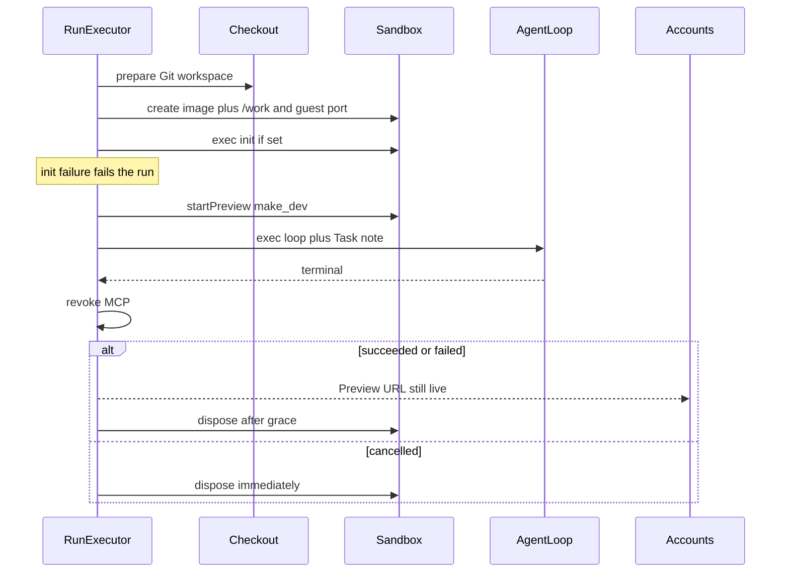

# Smol Preview backend

First slice is **backend + administrator settings**. No run-preview iframe. Domain: [CONTEXT.md](CONTEXT.md), [ADR 0024](docs/adr/0024-smolvm-default-sandbox-provider.md), [ADR 0025](docs/adr/0025-git-workspace-preview.md).

Track work as `.scratch/smol-preview/` (PRD + one issue per slice below).



## Contract (keep it small)

Extend [project/sandboxes/index.ts](project/sandboxes/index.ts) — do **not** leak smolvm/docker APIs into the executor:

```ts
interface SandboxSpec {
  image: string;
  volumes?: readonly string[];
  publish?: { guestPort: number }; // provider allocates host port
}

interface PreviewProcess {
  readonly url: string; // host-facing, for later UI
  exited: Promise<ExecutionResult>;
}

interface Sandbox {
  id: string;
  exec(request: ExecRequest): Promise<ExecutionResult>;
  startPreview(command: string, options?: { workdir?: string }): Promise<PreviewProcess>;
  dispose(): Promise<void>;
}
```

Port publish belongs on **create** (`docker run -p`, `smolvm machine create -p`) because neither runtime can add a forward after boot cheaply.

Executor rules (all in [project/runs/index.ts](project/runs/index.ts) `execute`):

- Preview path only when `workspace?.git` **and** workspace Preview command is set.
- Init = blocking `exec`; non-zero fails the run (entrypoint).
- Then `startPreview`; do not wait for HTTP ready.
- Append Task note (same pattern as attachments in [project/agents/roster.ts](project/agents/roster.ts)): command was started; no URL/port/env.
- Record `preview: { url, state: "live" | "dead" }` on `RunRecord` (in-memory is enough; later UI reads this). If `exited` settles, mark `dead`; run continues.
- `finally`: always revoke MCP at terminal. Delay **sandbox + host workspace** dispose by grace only when Preview was started and outcome is succeeded/failed. Cancel and timeout already dispose immediately via `cancelRun` — keep that.
- Warm Grill path already keeps the sandbox for idle TTL; do not add a second grace there. Cold runs are the Preview product.

Inject Preview config into the executor as a port (`getPreviewConfig(): PreviewConfiguration | undefined`), not by reading SQLite from `runs/`.

## Slice 1 — smolvm provider parity

Mirror [project/providers/docker-sandbox.ts](project/providers/docker-sandbox.ts): `createSmolvmSandboxProvider({ runner })` with `BunCommandRunner("smolvm")`.

- Persistent machine: `create --name --image --net -v host:/work`, `start`, idle-or-equivalent so `exec` works, `delete -f` on dispose.
- Landmine: guest → host MCP/model. Docker uses `host.container.internal`. Discover smolvm’s host gateway (port-forward vs documented host IP) and keep the OpenAI rewrite in [project/providers/openai-agents-runtime.ts](project/providers/openai-agents-runtime.ts) working for that hostname.
- Wire `parseSandboxProvider` in [project/gui/src/server/coordinator.ts](project/gui/src/server/coordinator.ts): accepted `smolvm | apple-container | docker`; still fail if unset; list all three.
- [scripts/setup.ts](scripts/setup.ts): default option `smolvm`; `requireRuntime` checks `smolvm` CLI; keep container/docker as escape hatches.
- Update `.env.example`, setup tests, coordinator tests.

Out of this slice: Preview, Docker-in-VM, image rebuilds. Prove Cursor + openai-agents still `exec` in a smolvm guest.

## Slice 2 — Preview on every provider

Implement `publish` + `startPreview` on smolvm, docker (`-p` at run, `exec -d` for the command), and apple-container (same idea via its CLI).

- `startPreview` must not steal agent stdout (ADR 0003). Detached process; wait on `exited` in the background only to flip `preview.state`.
- Tests: fake `CommandRunner` like existing docker/apple sandbox tests.

## Slice 3 — Workspace Preview configuration

Copy the LLM singleton slice (not skills/connections):

- Migration `project/gui/drizzle/0033_workspace_preview_config.sql` (`id = 1`, `init_command`, `preview_command`, `guest_port`, `grace_duration_ms`). Empty/missing `preview_command` ⇒ skip Preview.
- Store [project/gui/src/server/features/workspace/preview-config.ts](project/gui/src/server/features/workspace/preview-config.ts) with `public()` / `save()` / `preview()` for the orchestrator.
- Admin GET/POST `/api/workspace/settings/preview` in [admission-http.ts](project/gui/src/server/features/accounts/admission-http.ts).
- Settings card on [workspace-settings.tsx](project/gui/src/features/workspace/workspace-settings.tsx) (TanStack Query, no `useEffect`): optional init, Preview command, guest port, grace duration.
- Coordinator creates the store and passes `preview()` into the run executor.

## Slice 4 — Executor wiring

[project/runs/index.ts](project/runs/index.ts) + [project/runs/run-executor.test.ts](project/runs/run-executor.test.ts) (fake sandbox):

1. After prepare, if git + config: add `publish: { guestPort }` to spec.
2. After create: init `exec` if set.
3. `startPreview(previewCommand, { workdir: "/work" })`.
4. Patch task with the note; `store.update` preview URL live.
5. Split `finally`: revoke MCP always; schedule sandbox/workspace dispose (`graceDurationMs`) unless cancelled/timeout already disposed.
6. Host `/work` must outlive the agent until sandbox dispose (bind mount).

Roster only needs the note if the executor does not rewrite `record.task` before `runtime.run`. Prefer **one place**: executor, after Preview actually started, so skipped Preview does not lie.

## Slice 5 — Docker-in-VM on the cursor image

Only the Git-workspace person (cursor image, [project/Dockerfile.cursor](project/Dockerfile.cursor)) needs nested Docker so `make dev` / Compose works.

- Follow smolvm’s docker-in-vm setup (guest engine, not host socket — rejected).
- Add `make` / Compose / dockerd (or whatever that example requires) to the cursor image; smolvm provider enables the VM-side Docker-in-VM flag at create.
- openai-agents image unchanged.
- Escape-hatch docker/apple still implement Preview as “start this command + forward port”; nested Compose is smolvm-specific and may fail there.

## Explicitly later

- Account Preview iframe / authenticated reverse proxy.
- `SWEAT_*` → `COLONY_*` rename.
- Distinct environment image / `.smolmachine` packing.
- Gating the agent on Preview health.

## Tests (existing style)

Provider tests with a fake `CommandRunner`; executor tests with a fake `Sandbox` that records `create` spec, `exec` vs `startPreview`, and dispose times. Settings store + admission HTTP tests copied from LLM. No live hypervisor required for CI.
