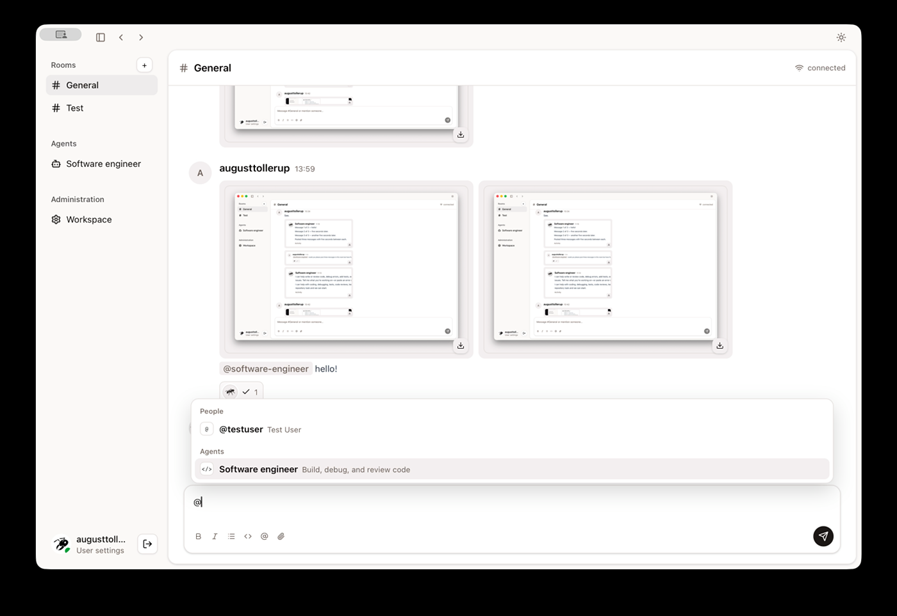

# Colony

Colony is a self-hosted multiplayer workspace where people delegate work to
isolated AI agents, follow it as it happens, and keep the results with the
conversation.

[](./sweat-demo.mov?raw=1)

_Click the preview to watch the demo._

## Vision

Colony should feel like a shared place where people and agents work together,
not a dashboard for launching background processes. Teams organize work in
durable rooms, delegate bounded runs to visible agent roles, and retain tasks,
progress, results, and decisions as one shared record.

Each deployment owns its accounts, data, model configuration, integrations,
and sandboxed agent execution. The native Tauri app and browser client connect
to the same authoritative Colony server.

Read [VISION.md](./VISION.md) for the product direction,
[CONTEXT.md](./CONTEXT.md) for the domain language,
[docs/architecture.md](./docs/architecture.md) for the current architecture,
and [docs/issue-dispatch-integrate.md](./docs/issue-dispatch-integrate.md) for
how Issues dispatch child agent runs and integrate afterward.

## Install

Clone the repository and run the setup wizard:

```bash
git clone https://github.com/4ug-aug/colony.git
cd colony
make setup
```

Choose **Server setup** to configure `.env.local`. The wizard generates the
authentication secret, asks for the server URL, browser origin, sandbox
runtime, and optional GitHub and Linear integrations. It preserves existing
values, backs up an existing environment file, installs dependencies, pulls the
CI-published agent image, and runs database migrations.

The server setup supports [smolvm](https://github.com/smol-machines/smol) (the
default), [Apple Container](https://github.com/apple/container) and Docker.
Install the selected runtime before running the wizard — smolvm also needs
Docker or Apple Container present to build the agent image, and a version that
supports `machine fork` to start runs by cloning a warm microVM instead of
booting one. Start the
configured server with `make server` or the local full stack with `make dev`.
Configure the model provider after first sign-in from Workspace Settings.

On a Linux host with systemd, install the configured server as a background
user process:

```bash
make service-install
systemctl --user status sweat
journalctl --user -u sweat -f
```

The installer enables user lingering so Colony starts at boot without an
interactive login. Use `systemctl --user start|stop|restart sweat` for normal
operation and `make service-uninstall` to remove it. The unit points at this
checkout and the Bun executable used during installation; rerun
`make service-install` after moving either one. `make server` remains the
foreground diagnostic command.

To upgrade a running source-checkout server, pull the latest checkout, refresh
dependencies, rebuild the agent image, regenerate the unit, and restart:

```bash
make service-upgrade
```

That runs `git pull --ff-only` first so the service is not restarted on a
stale checkout. It rebuilds the local agent image, but never pulls a published
one: a host whose `SWEAT_AGENT_IMAGE` names a GHCR tag keeps running the copy it
already has until you `docker pull` it yourself. The coordinator exports the
local image as-is, so a stale one is invisible apart from the code the agents
run being older than the server's.
`make dev` / `make agent` always build local `sweat-agent:latest` and
`sweat-agent-cursor:latest` images for your machine's architecture. Published
GHCR images are for production/server hosts and are linux/amd64 today; after
the first release, set `colony-agent` to Public in the package settings if
GitHub created it as private.

Choose **Install mac application** on macOS to download and open the latest
universal DMG. Drag Colony into Applications, then connect it to the server URL
and enter the one-time setup token to create the first administrator.

Windows has no wizard step because it needs none. Open the
[latest release](https://github.com/4ug-aug/colony/releases/latest) and run
`Sweat_<version>_x64_en-US.msi` (or `Sweat_<version>_x64-setup.exe` if you
prefer the NSIS installer). Both install Colony and register the legacy `sweat://`
invite scheme; then connect to the server URL the same way. A Windows machine
needs no clone, no `make`, and no container runtime — only the server host does.

The current builds are not signed. If macOS blocks the first launch,
Control-click Colony, choose **Open**, then confirm. If Windows SmartScreen warns
about an unrecognized publisher, choose **More info**, then **Run anyway**.

Installed builds carry no web inspector, so they write a log you can ask a user
to send back. The first line names the version and platform.

| Platform | Path                                              |
| -------- | ------------------------------------------------- |
| Windows  | `%LOCALAPPDATA%\com.sweat.desktop\logs\Colony.log` |
| macOS    | `~/Library/Logs/com.sweat.desktop/Colony.log`      |

## Development

```bash
cp .env.example .env.local
# Add a stable BETTER_AUTH_SECRET to .env.local
make dev
```

`make dev` migrates the database, builds the agent image, and starts an empty
invite-only workspace. Use `make dev-seeded` for two reusable local accounts,
or `make server` and `make gui` separately to exercise the desktop boundary.
Run `make help` for every development command.

To enable repository-backed software-engineer runs, set `SWEAT_GITHUB_REPOSITORY`
and a fine-grained personal access token as `SWEAT_GITHUB_TOKEN`. See
[docs/github-token.md](docs/github-token.md). Set `SWEAT_VERIFY_COMMAND` to
allow verified pull-request publishing.

Configure Asana, Outline, and Grafana under **Workspace → Connections** after
sign-in (admin only). Save credentials there, then link each Connection to the
agents that should receive its tools. Clearing a Connection removes its
credentials and links. Env vars are not used for these providers.

A self-hosted Outline or other connection behind an internal CA also needs
`NODE_EXTRA_CA_CERTS` set to that CA bundle, or the coordinator fails with
`UNABLE_TO_VERIFY_LEAF_SIGNATURE`. This is the host's trust store: the
coordinator reaches provider MCP upstreams directly, while `SWEAT_AGENT_CA_CERT`
covers only agent containers. Set it in `.env.local`.
`make service-install` / `make service-upgrade` hoist it into the systemd unit
`Environment=` so Bun sees it before TLS starts; a bare
`bun --env-file=… src/server/coordinator.ts` still reads it too late.

Back up the SQLite database together with its sibling `attachments/`
directory.
