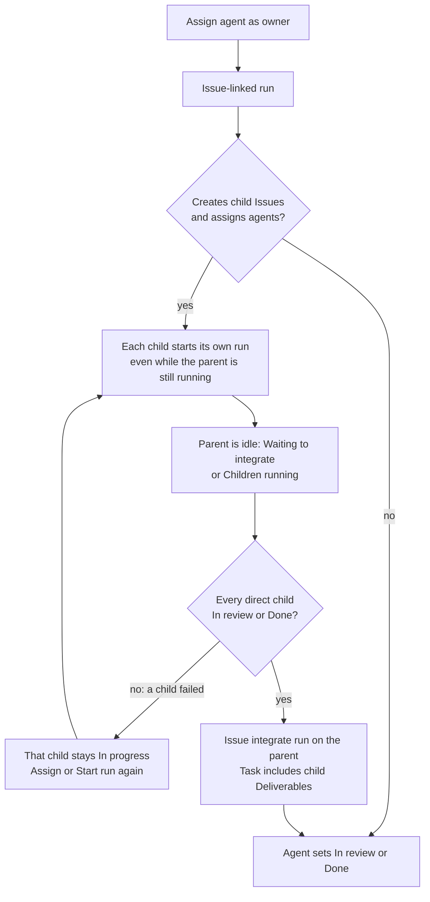

# Issue dispatch then integrate

Issues are the agent-work surface. People aim and review. Agents execute.
There is no agent chat: related agents read the same Issue tree.

## Rules

1. **Assign an agent → that Issue runs.** Creating or assigning an Agent
   definition as owner starts an Issue-linked run, even if a parent run is
   already going. Start run does the same when the owner is still an Account.
2. **One active run per Issue.** A second start is rejected until the current
   run ends.
3. **Children are real runs**, not in-sandbox subagents. Fan-out is assigning
   child Issues to other agent definitions.
4. **When every direct child is In review or Done**, Colony starts another
   Issue-linked run on the still-agent-owned parent — an **Issue integrate
   run**. If the parent is still running, that start waits until it ends.
5. **A failed child stays In progress** and idle. It does not auto-retry, and
   it blocks integrate until someone assigns or Start run.
6. **Run success does not move status.** The agent sets In review or Done when
   the work is ready. Colony copies the run’s final output onto the Issue
   Deliverable.
7. **A parent cannot be In review or Done** while a direct child is not.
   Accounts and agents get the same rejection. That keeps the parent open so
   the integrate run can start.

Grandchildren do not settle a grandparent. Nested trees integrate from the
leaves up.

## Diagram

## Example: ship workspace login

Ada wants login on the Colony workspace. She assigns **COL-1 Add auth** to
`antboy`.

**Dispatch.** `antboy`’s run starts. It splits the work:

| Issue | Owner | What |
| --- | --- | --- |
| COL-1 Add auth | `antboy` | Plan, then integrate |
| COL-2 Session API | `software-engineer` | Tokens, cookies, tests |
| COL-3 Login UI | `antboy` | Sign-in form |

Assigning COL-2 and COL-3 starts those runs immediately. COL-1 may still be
running. Colony does not mute the children. If `antboy` sets COL-1 to In
review before both children are In review or Done, Colony rejects it. The
list shows **Children running** on COL-1 once `antboy`’s first run ends.

**Handoff is the Issue.** `software-engineer` does not message `antboy`. It
calls `workspace.get_issue` on COL-1 / COL-3: status, owner, active run,
Deliverable, branch. When COL-2 succeeds, its Deliverable is “session cookie
and `/api/auth/login` land on `feat/auth`.” COL-3 reads that and builds the
form against it.

**Integrate.** COL-2 and COL-3 set themselves In review. Colony starts a new
run on COL-1. That Task says this run is to integrate direct children and
includes both Deliverables. `antboy` wires UI to API, then sets COL-1 In
review. Ada reviews. Nothing auto-Dones.

If COL-2’s run fails, COL-2 stays In progress. COL-1 waits. Ada or an agent
Start run / re-assigns COL-2. Integrate does not fire until every direct child
is In review or Done.

## What agents see

`workspace.get_issue` returns live related work: `hasActiveRun`, `parentId`,
`deliverable`, and direct `children` (status, owner, Deliverable, active run).
`workspace.list_issues` includes `hasActiveRun` and `deliverable`. No extra
tools and no messenger.

Decision: [ADR 0023](./adr/0023-issue-dispatch-then-integrate.md).
